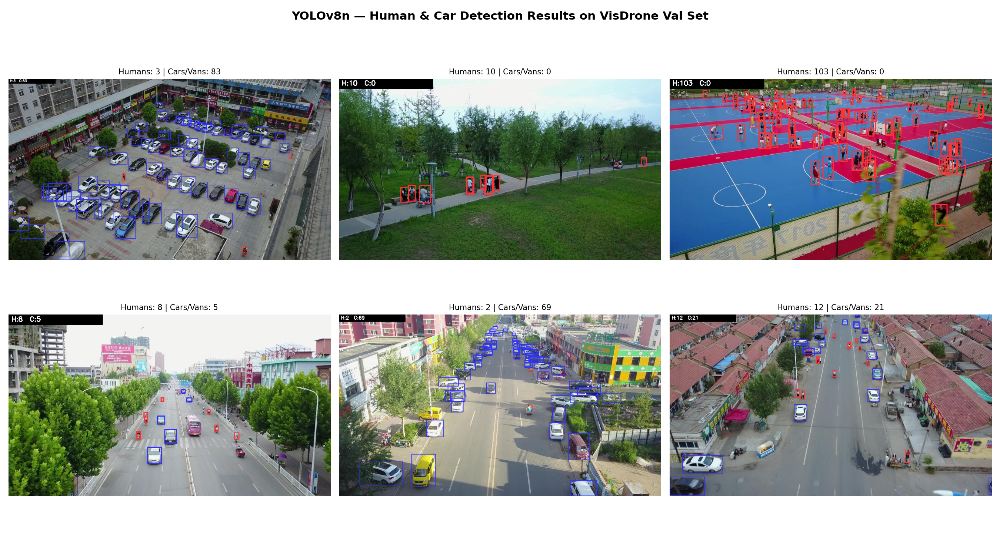
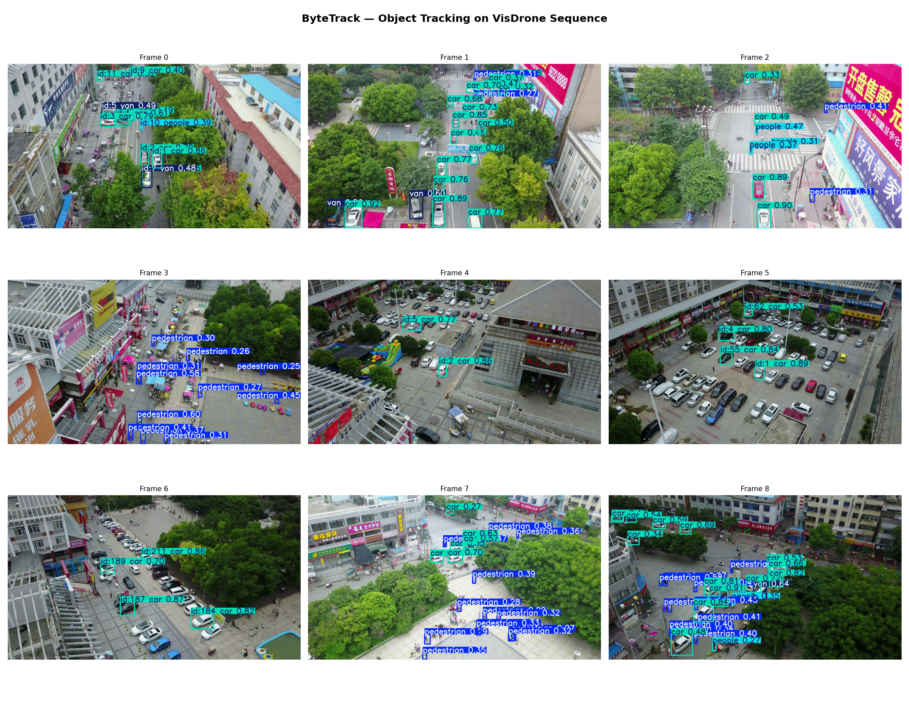
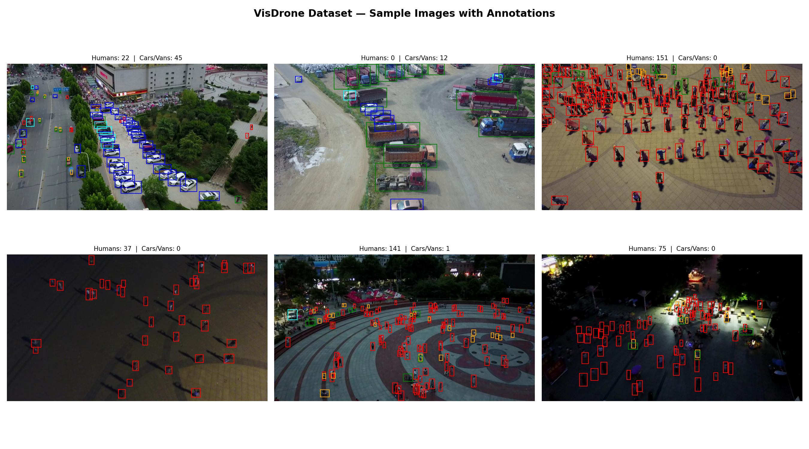

# 🚁 Drone Human & Car Detection System
**Antlings Internship Program — Technical Assessment (AI/ML)**

## 📌 Overview
A computer vision pipeline built on YOLOv8n to detect humans and cars 
in drone/aerial imagery, count total humans, and track objects across frames 
using ByteTrack — trained on the VisDrone 2019 dataset.

---

## 📊 Final Results

| Metric | Value |
|--------|-------|
| mAP@50 | 26.9% |
| mAP@50-95 | 14.9% |
| Precision | 39.0% |
| Recall | 30.2% |
| Inference Speed | ~2ms/image |

### Per-class mAP@50
| Class | mAP@50 |
|-------|--------|
| Car | 69.9% ✅ |
| Bus | 37.4% ✅ |
| Van | 30.0% |
| Motor | 29.0% |
| Pedestrian | 27.6% |
| People | 20.2% |
| Bicycle | 4.2% |

---

## 🗂️ Dataset
- **VisDrone 2019 Detection Dataset**
- 6,471 training images | 548 validation images
- 10 object classes, pre-converted to YOLO format

### Dataset Challenges
- Very small objects from high altitude
- Dense crowds with heavy occlusion  
- Class imbalance (cars >> other classes)
- Day/night/low-light variation

---

## 🧠 Model
- **Architecture:** YOLOv8n (nano) fine-tuned on VisDrone
- **Epochs:** 20 | **Image size:** 640×640
- **Optimizer:** AdamW
- **Augmentation:** Mosaic, random flip, HSV shift

---

## 📁 Project Structure
├── drone_detection.ipynb        # Full pipeline notebook
├── outputs/
│   ├── sample_visualization.png
│   ├── multi_sample_visualization.png
│   ├── final_results_grid.png
│   └── tracking_visualization.png
└── README.md

---

## ⚙️ Setup & Run

```bash
pip install ultralytics
```

### Run Detection
```python
from ultralytics import YOLO
model = YOLO('best.pt')
results = model('your_image.jpg', conf=0.25)
results[0].show()
```

### Run Tracking
```python
results = model.track(
    source='your_video.mp4',
    tracker='bytetrack.yaml',
    conf=0.25
)
```

---

## 📈 Sample Results

### Detection Output


### Tracking Output


### Dataset Samples


---

## ✅ Strengths
- Fast inference (~2ms/image on GPU)
- Excellent car detection (69.9% mAP@50)
- Handles dense crowd scenes (103 humans counted)
- ByteTrack integration for multi-object tracking

## ⚠️ Limitations
- Small object detection is weak (bicycle 4.2%)
- More epochs or larger model would improve recall
- Night images remain challenging

## 🔧 Challenges Faced
- VisDrone yaml path mismatch with Ultralytics
- Colab session resets losing trained weights
- Only 9 frames in one drone sequence for tracking demo

---

## 📦 Tools Used
- YOLOv8n (Ultralytics)
- ByteTrack (built-in tracker)
- OpenCV, Matplotlib
- Google Colab (T4 GPU)
- VisDrone 2019 Dataset
